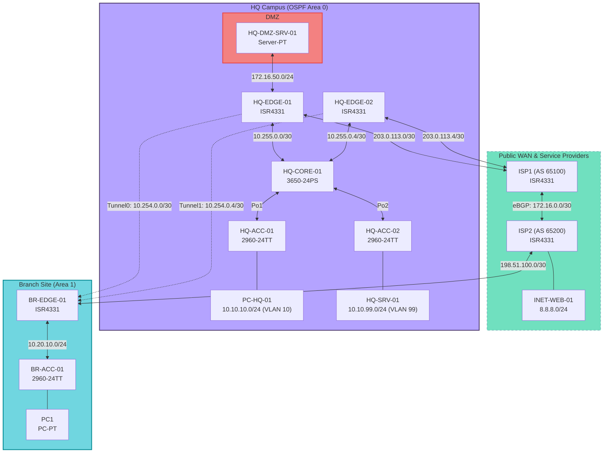

# Enterprise Multi-Site Hybrid Network Architecture & Engineering Reference

## 1. Executive Summary & Design Scope

This architecture document specifies the design, implementation, and verification of a dual-site enterprise network infrastructure connecting a primary Headquarters (HQ) campus to a remote Branch office over an untrusted public WAN via Generic Routing Encapsulation (GRE). 

The infrastructure enforces:
* Deterministic Layer 2 switching boundaries with Spanning Tree hardening (PortFast, BPDU Guard, Root Guard).
* Segmentation across enterprise user access, voice, server management, and an isolated perimeter Demilitarized Zone (DMZ).
* Hybrid routing with OSPFv2 Area 0 interior routing and localized Direct Internet Access (DIA) via static default routing at the branch.
* Perimeter security via 1:1 Static NAT, dynamic PAT overload with route-exempt extended access control, and directional ACL state enforcement.

---

## 2. Logical Topology & Addressing Plan

### Network Topology Diagram

### IP Addressing Schema

| Segment / Link | Devices Connected | Network | Interface Roles |
| :--- | :--- | :--- | :--- |
| **ISP Interconnect** | `ISP1` $\leftrightarrow$ `ISP2` | `172.16.0.0/30` | eBGP Transit (`AS 65100` $\leftrightarrow$ `AS 65200`) |
| **HQ WAN 1** | `HQ-EDGE-01` $\leftrightarrow$ `ISP1` | `203.0.113.0/30` | Primary public WAN uplink |
| **HQ WAN 2** | `HQ-EDGE-02` $\leftrightarrow$ `ISP1` | `203.0.113.4/30` | Secondary public WAN uplink |
| **HQ Transit 1 (Tunnel0)** | `HQ-EDGE-01` $\leftrightarrow$ `BR-EDGE-01` | `203.0.113.2` (`10.255.0.0/30`) | Primary point-to-point GRE tunnel |
| **HQ Transit 2 (Tunnel1)** | `HQ-EDGE-02` $\leftrightarrow$ `BR-EDGE-01` | `203.0.113.6` (`10.255.0.4/30`) | Redundant point-to-point GRE tunnel |
| **HQ DMZ** | `HQ-EDGE-01` $\leftrightarrow$ `HQ-DMZ-SRV-01` | `172.16.50.0/24` | Isolated DMZ subnet |
| **HQ Data (VLAN 10)** | `HQ-CORE-01` $\leftrightarrow$ `HQ-ACC-01` $\leftrightarrow$ `PC-HQ-01` | `10.10.10.0/24` | Client access via `Po1` trunk |
| **HQ VoIP (VLAN 20)** | `HQ-CORE-01` $\leftrightarrow$ `HQ-ACC-01` $\leftrightarrow$ | `10.10.20.0/24` | Client access via `Po1` trunk |
| **HQ Mgmt/Srv (VLAN 99)** | `HQ-CORE-01` $\leftrightarrow$ `HQ-ACC-02` $\leftrightarrow$ `HQ-SRV-01` | `10.10.99.0/24` | Infrastructure services via `Po2` trunk |
| **Public Service** | `ISP2` $\leftrightarrow$ `INET-WEB-01` | `8.8.8.0/24` | Public internet web service host |
| **Branch WAN** | `ISP2` $\leftrightarrow$ `BR-EDGE-01` | `198.51.100.0/30` | Branch public internet breakout |
| **Branch LAN** | `BR-EDGE-01` $\leftrightarrow$ `BR-ACC-01` $\leftrightarrow$ `PC1` | `10.20.10.0/24` | Branch client access network |

---

## 3. Layer 2 Access & Hardening Specifications

* **VLAN & Trunking:** 802.1Q encapsulation with explicit allowed VLAN lists.
* **Link Aggregation:** Multi-chassis LACP/PAgP EtherChannels spanning access-to-core uplinks.
* **Spanning Tree Architecture:**
  * **Mode:** Rapid Spanning Tree Protocol (PVRST+ / Rapid-PVST).
  * **Root Placement:** `HQ-CORE-01` serves as the primary root bridge across all active VLANs (`spanning-tree vlan 10,20,99 priority 4096`).
  * **Root Guard:** Applied on all downstream-facing distribution switchports (`HQ-CORE-01` $\rightarrow$ `HQ-ACC-01/02`) to prevent rogue root takeovers.
  * **Edge Hardening:** Host-facing switchports operate with `spanning-tree portfast` enabled to bypass listening/learning phases. BPDU Guard is globally active to error-disable ports if rogue switches are attached.
* **Access Port Security:** Configured via `switchport port-security` using `mac-address sticky`, a maximum of 2 allowed addresses per port, and a `shutdown` violation action.

---

## 4. Layer 3 Routing & WAN Architecture

* **Underlay Routing (Direct Internet Access):**
  * `HQ-EDGE-01`: Static default route pointing to ISP1 (`203.0.113.1`).
  * `HQ-EDGE-02`: Static default route pointing to ISP1 (`203.0.113.5`).
  * `BR-EDGE-01`: Static default route pointing to ISP2 (`198.51.100.1`) for split-tunnel local breakout, bypassing the corporate GRE tunnel for general web traffic.
* **Overlay GRE Tunnel:**
  * Point-to-Point GRE connecting `HQ-EDGE-01` and `BR-EDGE-01`.
  * Point-to-Point GRE connecting `HQ-EDGE-02` and `BR-EDGE-01`.
  * TCP Maximum Segment Size (MSS) clamped to `1436` bytes and MTU set to `1476` to mitigate packet fragmentation across the 24-byte GRE encapsulation overhead.
* **IGP Design (Hierarchical Multi-Area OSPF):**
  * **Area Boundaries & ABR Placement:**
    * **Backbone (Area 0):** Confined strictly to the HQ campus interior, encompassing `HQ-CORE-01`, the internal VLANs, and the point-to-point routed transit links (`10.255.0.0/30` and `10.255.0.4/30`) up to `HQ-EDGE-01` and `HQ-EDGE-02`.
    * **Branch & WAN Transit (Area 1):** Spans both overlay GRE interfaces (`Tunnel0` on `10.254.0.0/30` and `Tunnel1` on `10.254.0.4/30`) and the branch access network (`10.20.10.0/24`) on `BR-EDGE-01`.
    * **ABR Roles:** `HQ-EDGE-01` and `HQ-EDGE-02` serve as the **Area Border Routers (ABRs)**, bridging internal campus Area 0 with WAN overlay Area 1. `BR-EDGE-01` operates purely as an internal Area 1 router.
  * **Passive-Interface Policy:**
    * **Campus Switched Virtual Interfaces (SVIs):** OSPF Hellos are suppressed on logical gateway interfaces (`passive-interface Vlan10`, `Vlan20`, and `Vlan99`) on `HQ-CORE-01`. This advertises campus access subnets into Area 0 while preventing rogue neighbor adjacencies or route poisoning from compromised host access ports.
    * **Perimeter & Remote Access Ports:** Hellos are suppressed on host-facing router boundaries (HQ Perimeter DMZ `Gi0/2` on `HQ-EDGE-01` and Branch LAN `Gi0/1` on `BR-EDGE-01`).
    * **Adjacency Preservation:** Hellos remain active across point-to-point campus transit interconnects GRE tunnels `Tunnel0` (`10.255.0.0/30`), `Tunnel1` (`10.255.0.4/30`).
  * **Inter-Area Propagation & Default Routing:**
    * `HQ-EDGE-01` and `HQ-EDGE-02` translate Area 0 campus and DMZ prefixes into Type 3 Summary LSAs and inject them across the GRE tunnels into Area 1.
    * `HQ-EDGE-01` originates an external Type 5 default route (`default-information originate always`) to provide outbound Internet transit for `HQ-CORE-01`.
    * `BR-EDGE-01` retains its local Direct Internet Access (DIA) via a local static default route (`0.0.0.0/0` via `ISP2`), using longest-prefix match on Type 3 inter-area routes (`10.10.0.0/16`, `172.16.50.0/24`) to steer corporate traffic across the GRE tunnels back into Area 0.

---

## 5. Perimeter Security, NAT & DMZ Policy

* **Inside/Outside NAT Demarcation:**
  * `HQ-EDGE-01` WAN (`Gi0/0`) marked as `nat outside`.
  * Transit (`Gi0/1`) and DMZ (`Gi0/2`) links marked as `nat inside`.
* **NAT Policies:**
  * **Static 1:1 NAT:** Public IP mapping to the DMZ web server (`ip nat inside source static 172.16.50.10 203.0.113.10`).
  * **Dynamic PAT (Overload):** RFC 1918 outbound translations for internal users. Governed by an extended access control list that explicitly exempts Branch-bound traffic (`10.10.0.0/16` $\rightarrow$ `10.20.0.0/16`) and GRE Protocol 47 from translation.
* **Perimeter Access Control Lists (ACLs):**
  * **Inbound WAN (OUTSIDE_IN):** Permits IP Protocol 47 (GRE) from the Branch WAN IP, established TCP sessions, and inbound HTTP/HTTPS specifically directed to the DMZ host. Explicit deny-all drops unauthorized traffic.
  * **DMZ Containment (DMZ_RESTRICT):** Isolates the DMZ from initiating lateral sessions into the internal enterprise subnets (`10.10.0.0/16`, `10.20.0.0/16`) while permitting outbound Internet access for patches and updates.

---

## 6. Architecture Decision Record (ADR): DHCP Snooping

* **Context:** Evaluation of Layer 2 DHCP Snooping, Option 82 handling, and Trust boundaries across virtualized emulation.
* **Observed Limitation:** Simulation engine failures where valid DHCP Offers received on explicitly designated `trusted` trunk/EtherChannel ports are discarded (`DHCP_SNOOPING_NONZERO_GIADDR` / logic drops).
* **Workaround Implemented:** DHCP Snooping disabled globally across the emulation environment. Static IP assignments and unrestricted L2 forwarding applied to facilitate functional verification of Layer 3 architectures.
* **Production Deployment Requirement:** On physical hardware, configure `no ip dhcp snooping information option` on access switches, apply `ip dhcp snooping trust` directly on Port-Channel logical interfaces, and deploy `allow-untrusted` on Core uplinks to normalize Option 82 processing.

---

## 7. Verification Matrix & Evidence Collection

| Test Domain | Device Under Test | Command / Probe | Target Success State |
| :--- | :--- | :--- | :--- |
| **L2 Switching** | `HQ-CORE-01` | `show spanning-tree root` | Local switch ID matches Root for VLANs 10, 20, 99 |
| **EtherChannel** | `HQ-ACC-01` | `show etherchannel summary` | Bundled ports display flag `(P)` in port-channel `(SU)` |
| **OSPF Adjacency** | `HQ-EDGE-01` | `show ip ospf neighbor` | Full adjacency on Transit (`Gi0/1`) and Tunnel (`Tunnel0`) |
| **Routing Tables** | `BR-EDGE-01` | `show ip route 0.0.0.0` | Active default path via ISP2 (`198.51.100.1`) with AD 1 |
| **GRE Data Plane** | `BR-EDGE-01` | `ping 10.10.10.50 source Gi0/1` | 5/5 ICMP success traversing Tunnel0 without packet loss |
| **Static NAT** | External Host | `curl http://203.0.113.10` | HTTP 200 OK from DMZ server |
| **DMZ Isolation** | `HQ-DMZ-SRV-01` | `ping 10.10.10.50` | 0/5 ICMP success (Blocked by `DMZ_RESTRICT` ACL) |
| **NAT Translations** | `HQ-EDGE-01` | `show ip nat translations` | Static mapping active; dynamic overload sessions active |
