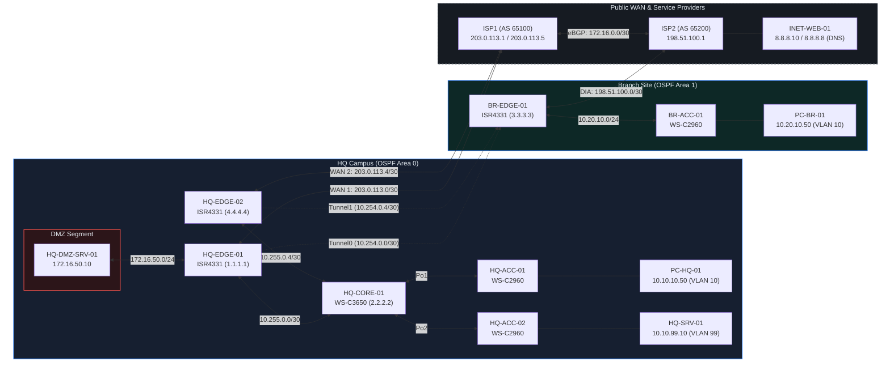

# Enterprise Multi-Site Hybrid Network Architecture & Engineering Reference

## 1. Executive Summary & Design Scope

This architecture document specifies the design, implementation, and verification of a dual-site enterprise network infrastructure connecting a primary Headquarters (HQ) campus to a remote Branch office over an untrusted public WAN via Generic Routing Encapsulation (GRE). 

The infrastructure enforces:
* Deterministic Layer 2 switching boundaries with Spanning Tree hardening (PortFast, BPDU Guard, Root Guard).
* Segmentation across enterprise user access, voice, server management, and an isolated perimeter Demilitarized Zone (DMZ).
* Hybrid routing with OSPFv2 Area 0 interior routing and localized Direct Internet Access (DIA) via static default routing at the branch.
* Perimeter security via 1:1 Static NAT, dynamic PAT overload with route-exempt extended access control, and directional ACL state enforcement.

---

## 2. Logical Topology & Addressing Plan

### Network Topology Diagram



### IP Addressing Schema

| Segment / Link | Devices Connected | Network | Interface Roles |
| :--- | :--- | :--- | :--- |
| **ISP Interconnect** | `ISP1` $\leftrightarrow$ `ISP2` | `172.16.0.0/30` | eBGP Transit (`AS 65100` $\leftrightarrow$ `AS 65200`) |
| **HQ WAN 1** | `HQ-EDGE-01` $\leftrightarrow$ `ISP1` | `203.0.113.0/30` | Primary public WAN uplink |
| **HQ WAN 2** | `HQ-EDGE-02` $\leftrightarrow$ `ISP1` | `203.0.113.4/30` | Secondary public WAN uplink |
| **HQ Tunnel0** | `HQ-EDGE-01` $\leftrightarrow$ `BR-EDGE-01` | `203.0.113.2` (`10.254.0.0/30`) | Primary point-to-point GRE tunnel |
| **HQ Tunnel1** | `HQ-EDGE-02` $\leftrightarrow$ `BR-EDGE-01` | `203.0.113.6` (`10.254.0.4/30`) | Secondary point-to-point GRE tunnel |
| **HQ DMZ** | `HQ-EDGE-01` $\leftrightarrow$ `HQ-DMZ-SRV-01` | `172.16.50.0/24` | Isolated DMZ subnet |
| **HQ Transit 1** | `HQ-CORE-01` $\leftrightarrow$ `HQ-EDGE-01` | `10.255.0.0/30` | Core routed uplink / Edge routed downlink |
| **HQ Transit 2** | `HQ-CORE-01` $\leftrightarrow$ `HQ-EDGE-02` | `10.255.0.4/30` | Redundant Core routed uplink / Edge downlink |
| **HQ Data (VLAN 10)** | `HQ-CORE-01` $\leftrightarrow$ `HQ-ACC-01` $\leftrightarrow$ `PC-HQ-01` | `10.10.10.0/24` | Client access via `Po1` trunk |
| **HQ VoIP (VLAN 20)** | `HQ-CORE-01` $\leftrightarrow$ `HQ-ACC-01` $\leftrightarrow$ | `10.10.20.0/24` | Client access via `Po1` trunk |
| **HQ Mgmt/Srv (VLAN 99)** | `HQ-CORE-01` $\leftrightarrow$ `HQ-ACC-02` $\leftrightarrow$ `HQ-SRV-01` | `10.10.99.0/24` | Infrastructure services via `Po2` trunk |
| **Public Service** | `ISP2` $\leftrightarrow$ `INET-WEB-01` | `8.8.8.0/24` | Public internet web service host |
| **Branch WAN** | `ISP2` $\leftrightarrow$ `BR-EDGE-01` | `198.51.100.0/30` | Branch public internet breakout |
| **Branch LAN** | `BR-EDGE-01` $\leftrightarrow$ `BR-ACC-01` $\leftrightarrow$ `PC1` | `10.20.10.0/24` | Branch client access network |

---

## 3. Layer 2 Access & Hardening Specifications

* **VLAN & Trunking:** 802.1Q encapsulation with explicit allowed VLAN lists.
* **Link Aggregation:** Multi-chassis LACP/PAgP EtherChannels spanning access-to-core uplinks.
* **Spanning Tree Architecture:**
  * **Mode:** Rapid Spanning Tree Protocol (PVRST+ / Rapid-PVST).
  * **Root Placement:** `HQ-CORE-01` serves as the primary root bridge across all active VLANs (`spanning-tree vlan 10,20,99 priority 4096`).
  * **Root Guard:** Applied on all downstream-facing distribution switchports (`HQ-CORE-01` $\rightarrow$ `HQ-ACC-01/02`) to prevent rogue root takeovers.
  * **Edge Hardening:** Host-facing switchports operate with `spanning-tree portfast` enabled to bypass listening/learning phases. BPDU Guard is globally active to error-disable ports if rogue switches are attached.
* **Access Port Security:** Configured via `switchport port-security` using `mac-address sticky`, a maximum of 2 allowed addresses per port, and a `shutdown` violation action.

---

## 4. Layer 3 Routing & WAN Architecture

* **Underlay Routing (Direct Internet Access):**
  * `HQ-EDGE-01`: Static default route pointing to ISP1 (`203.0.113.1`).
  * `HQ-EDGE-02`: Static default route pointing to ISP1 (`203.0.113.5`).
  * `BR-EDGE-01`: Static default route pointing to ISP2 (`198.51.100.1`) for split-tunnel local breakout, bypassing the corporate GRE tunnel for general web traffic.
* **Overlay GRE Tunnel:**
  * Point-to-Point GRE connecting `HQ-EDGE-01` and `BR-EDGE-01`.
  * Point-to-Point GRE connecting `HQ-EDGE-02` and `BR-EDGE-01`.
  * TCP Maximum Segment Size (MSS) clamped to `1436` bytes and MTU set to `1476` to mitigate packet fragmentation across the 24-byte GRE encapsulation overhead.
* **IGP Design (Hierarchical Multi-Area OSPF):**
  * **Area Boundaries & ABR Placement:**
    * **Backbone (Area 0):** Confined strictly to the HQ campus interior, encompassing `HQ-CORE-01`, the internal VLANs, and the point-to-point routed transit links (`10.255.0.0/30` and `10.255.0.4/30`) up to `HQ-EDGE-01` and `HQ-EDGE-02`.
    * **Branch & WAN Transit (Area 1):** Spans both overlay GRE interfaces (`Tunnel0` on `10.254.0.0/30` and `Tunnel1` on `10.254.0.4/30`) and the branch access network (`10.20.10.0/24`) on `BR-EDGE-01`.
    * **ABR Roles:** `HQ-EDGE-01` and `HQ-EDGE-02` serve as the **Area Border Routers (ABRs)**, bridging internal campus Area 0 with WAN overlay Area 1. `BR-EDGE-01` operates purely as an internal Area 1 router.
  * **Passive-Interface Policy:**
    * **Campus Switched Virtual Interfaces (SVIs):** OSPF Hellos are suppressed on logical gateway interfaces (`passive-interface Vlan10`, `Vlan20`, and `Vlan99`) on `HQ-CORE-01`. This advertises campus access subnets into Area 0 while preventing rogue neighbor adjacencies or route poisoning from compromised host access ports.
    * **Perimeter & Remote Access Ports:** Hellos are suppressed on host-facing router boundaries (HQ Perimeter DMZ `Gi0/2` on `HQ-EDGE-01` and Branch LAN `Gi0/1` on `BR-EDGE-01`).
    * **Adjacency Preservation:** Hellos remain active across point-to-point campus transit interconnects GRE tunnels `Tunnel0` (`10.255.0.0/30`), `Tunnel1` (`10.255.0.4/30`).
  * **Inter-Area Propagation & Default Routing:**
    * `HQ-EDGE-01` and `HQ-EDGE-02` translate Area 0 campus and DMZ prefixes into Type 3 Summary LSAs and inject them across the GRE tunnels into Area 1.
    * `HQ-EDGE-01` originates an external Type 5 default route (`default-information originate always`) to provide outbound Internet transit for `HQ-CORE-01`.
    * `BR-EDGE-01` retains its local Direct Internet Access (DIA) via a local static default route (`0.0.0.0/0` via `ISP2`), using longest-prefix match on Type 3 inter-area routes (`10.10.0.0/16`, `172.16.50.0/24`) to steer corporate traffic across the GRE tunnels back into Area 0.
### ADR: Deferral of Dual-Stack IPv6 Deployment

* **Status:** Deferred / Planned for Phase 2
* **Context:** The enterprise perimeter, campus transit, and overlay GRE infrastructure currently operate exclusively on an IPv4 substrate utilizing hierarchical OSPFv2 and dynamic PAT with NAT exemption.
* **Decision:** IPv6 dual-stacking was deliberately excluded from the current deployment scope to prioritize control-plane stability, deterministic routing between Area 0 and Area 1, and fine-grained stateful perimeter boundary ACLs.
* **Operational Impact & Trade-Offs:**
  * Avoids running dual routing engines (OSPFv2 + OSPFv3) across resource-constrained branch and edge platforms.
  * Preserves single-stack GRE encapsulation without the overhead of IPv6 transport headers or secondary tunnel interfaces.
  * Relies on standard IPv4 PAT overload at WAN boundaries to preserve public address space.
* **Phase 2 Implementation Roadmap:**
  * Enable `ipv6 unicast-routing` globally on edge, core, and branch nodes.
  * Deploy OSPFv3 (Address Family mode) across transit links (`10.255.0.0/30` equivalent `/126` or `/64` subnets) and tunnel overlays.
  * Transition perimeter security from IPv4 NAT overload to stateful IPv6 inspection filtering (ZBF / reflexive ACLs), permitting outbound traffic while enforcing default-deny on unsolicited inbound Global Unicast Address (GUA) sessions.
---

## 5. Perimeter Security, NAT & DMZ Policy

### 5.1 NAT Interface Demarcation & Boundary Roles

The enterprise perimeter enforces a strict stateful boundary between RFC 1918 private campus space, isolated service segments, and untrusted transit networks:

* **HQ-EDGE-01 (Primary WAN, Overlay & DMZ Gateway):**
  * `GigabitEthernet0/0/0` (WAN 1 to ISP1 - `203.0.113.2/30`): **`ip nat outside`**
  * `GigabitEthernet0/0/1` (Transit to HQ-CORE-01 - `10.255.0.1/30`): **`ip nat inside`**
  * `GigabitEthernet0/0/2` (DMZ Segment - `172.16.50.1/24`): **`ip nat inside`**
  * `Tunnel0` (GRE Overlay to Branch - `10.254.0.1/30`): Bypasses NAT processing; routed natively via OSPF Area 1

* **HQ-EDGE-02 (Redundant WAN & Overlay Gateway):**
  * `GigabitEthernet0/0/0` (WAN 2 to ISP1 - `203.0.113.6/30`): **`ip nat outside`**
  * `GigabitEthernet0/0/1` (Transit to HQ-CORE-01 - `10.255.0.6/30`): **`ip nat inside`**
  * `GigabitEthernet0/0/2`: Disabled (`shutdown`)
  * `Tunnel1` (GRE Overlay to Branch - `10.254.0.5/30`): Bypasses NAT processing; routed natively via OSPF Area 1

---

### 5.2 Translation Policies & Configurations

#### A. Port-Forwarded Static NAT (DMZ Web Services)
Public HTTP and HTTPS access to `HQ-DMZ-SRV-01` (`172.16.50.10`) is statically mapped to the primary outside IP (`203.0.113.2`) on `HQ-EDGE-01`:

```cisco
! HQ-EDGE-01:
ip nat inside source static tcp 172.16.50.10 80 203.0.113.2 80
ip nat inside source static tcp 172.16.50.10 443 203.0.113.2 443
```

#### B. Dynamic PAT Overload & NAT Exemption
Campus internet breakout uses dynamic PAT bound to the primary WAN interface. Inter-site communications between HQ (`10.10.0.0/16`) and Branch (`10.20.0.0/16`) are explicitly exempted via `deny` statements to prevent address rewriting if traffic falls through to the default route:

```cisco
! Applied on HQ-EDGE-01 and HQ-EDGE-02:
ip access-list extended ACL_HQ_NAT
 deny ip 10.10.0.0 0.0.255.255 10.20.0.0 0.0.255.255
 permit ip 10.10.0.0 0.0.255.255 any
 permit ip 10.20.0.0 0.0.255.255 any
!
! PAT Overload Interface Binding:
ip nat inside source list ACL_HQ_NAT interface GigabitEthernet0/0/0 overload
```

---

### 5.3 Perimeter Access Control Policies

#### A. Inbound WAN Perimeter Policy (`OUTSIDE_IN`)
Bound inbound to `GigabitEthernet0/0/0` to restrict ingress traffic from untrusted networks:

```cisco
ip access-list extended OUTSIDE_IN
 remark Permit GRE from Branch Public IP
 permit gre host 198.51.100.2 host 203.0.113.2
 remark Allow established TCP sessions
 permit tcp any any established
 remark Inbound Web Access to DMZ Server (Pre-NAT and Post-NAT support)
 permit tcp any host 203.0.113.2 eq www
 permit tcp any host 203.0.113.2 eq 443
 permit tcp any host 172.16.50.10 eq www
 permit tcp any host 172.16.50.10 eq 443
 remark Allow External Ping to Outside WAN IP (Troubleshooting/SLA)
 permit icmp any host 203.0.113.2 echo
 permit icmp any any echo-reply
 remark Explicit Deny All
 deny ip any any
```

#### B. DMZ Lateral Movement Containment (`DMZ_RESTRICT`)
Bound inbound to `GigabitEthernet0/0/2` on `HQ-EDGE-01` to isolate DMZ services from corporate enterprise subnets:

```cisco
ip access-list extended DMZ_RESTRICT
 remark Block DMZ from initiating sessions to HQ Campus & Branch
 deny ip 172.16.50.0 0.0.0.255 10.10.0.0 0.0.255.255
 deny ip 172.16.50.0 0.0.0.255 10.20.0.0 0.0.255.255
 remark Allow DMZ outbound access (updates/external dependencies)
 permit ip any any
```
---

## 6. Architecture Decision Record (ADR): DHCP Snooping

* **Context:** Evaluation of Layer 2 DHCP Snooping, Option 82 handling, and Trust boundaries across virtualized emulation.
* **Observed Limitation:** Simulation engine failures where valid DHCP Offers received on explicitly designated `trusted` trunk/EtherChannel ports are discarded (`DHCP_SNOOPING_NONZERO_GIADDR` / logic drops).
* **Workaround Implemented:** DHCP Snooping disabled globally across the emulation environment. Static IP assignments and unrestricted L2 forwarding applied to facilitate functional verification of Layer 3 architectures.
* **Production Deployment Requirement:** On physical hardware, configure `no ip dhcp snooping information option` on access switches, apply `ip dhcp snooping trust` directly on Port-Channel logical interfaces, and deploy `allow-untrusted` on Core uplinks to normalize Option 82 processing.

* ### ADR: Split-Horizon DNS & Emulation Resolver Boundaries

* **Context:** Internal clients require resolution of DMZ resources via internal IP addresses (`172.16.50.10`) to prevent NAT hairpinning and TCP resets on `HQ-EDGE-01`, while external internet clients resolve the same FQDN to public NAT addresses (`203.0.113.2`).
* **Observed Limitation:** Cisco Packet Tracer DNS services do not support recursive querying, conditional forwarders, or BIND/Windows-style split-brain DNS views. A single server cannot dynamically forward external requests to public root/ISP resolvers (`8.8.8.8`).
* **Workaround Implemented:** Internal and external DNS authorities are isolated:
  * `HQ-SRV-01` (`10.10.99.10`) serves as the authoritative resolver for internal campus hosts with direct RFC 1918 records.
  * `INET-WEB-01` / ISP DNS (`8.8.8.8`) serves public WAN hosts with external NAT mappings.
* **Production Deployment Requirement:** Deploy enterprise DNS (Active Directory / BIND) configured with split-view zones or upstream conditional forwarders to route external queries recursively while serving local RFC 1918 addresses to campus VLANs.

---

> For complete test execution logs, CLI captures, and protocol analysis, see [VERIFICATION.md](./VERIFICATION.md).
